# AI Architecture Documentation
## AI-Powered Food Waste Reduction Assistant

**Version:** 1.0  
**Last Updated:** June 19, 2026  
**Purpose:** Comprehensive AI system architecture and design patterns

---

## Table of Contents

1. [Architecture Overview](#1-architecture-overview)
2. [System Components](#2-system-components)
3. [Data Flow Architecture](#3-data-flow-architecture)
4. [AI Model Architecture](#4-ai-model-architecture)
5. [Integration Patterns](#5-integration-patterns)
6. [Scalability Design](#6-scalability-design)
7. [Performance Optimization](#7-performance-optimization)
8. [Error Handling & Resilience](#8-error-handling--resilience)
9. [Security Architecture](#9-security-architecture)
10. [Deployment Architecture](#10-deployment-architecture)

---

## 1. Architecture Overview

### 1.1 High-Level System Architecture

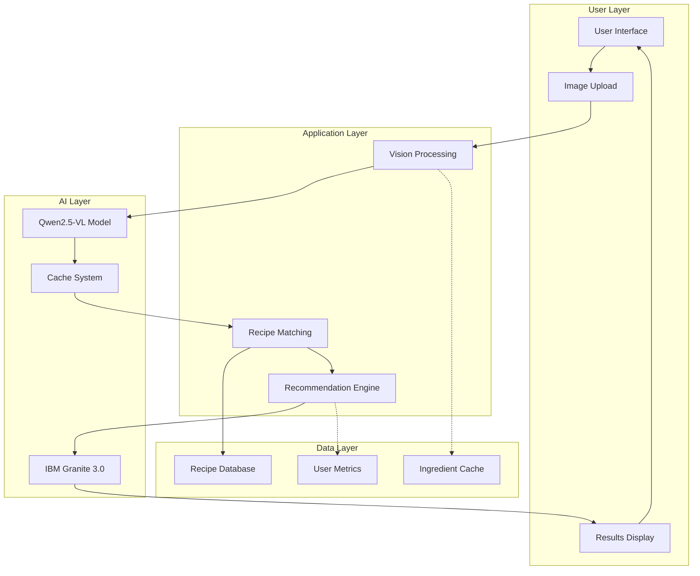
```mermaid
graph TB
    subgraph "User Layer"
        A[User Interface]
        B[Image Upload]
        C[Results Display]
    end
    
    subgraph "Application Layer"
        D[Vision Processing]
        E[Recipe Matching]
        F[Recommendation Engine]
    end
    
    subgraph "AI Layer"
        G[Qwen2.5-VL Model]
        H[IBM Granite 3.0]
        I[Cache System]
    end
    
    subgraph "Data Layer"
        J[Recipe Database]
        K[Ingredient Cache]
        L[User Metrics]
    end
    
    A --> B
    B --> D
    D --> G
    G --> I
    I --> E
    E --> J
    E --> F
    F --> H
    H --> C
    C --> A
    
    D -.-> K
    F -.-> L
```

### 1.2 Three-Layer AI Architecture

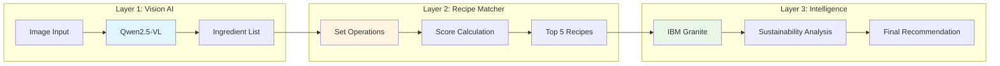
```mermaid
graph LR
    subgraph "Layer 1: Vision AI"
        A1[Image Input] --> A2[Qwen2.5-VL]
        A2 --> A3[Ingredient List]
    end
    
    subgraph "Layer 2: Recipe Matcher"
        A3 --> B1[Set Operations]
        B1 --> B2[Score Calculation]
        B2 --> B3[Top 5 Recipes]
    end
    
    subgraph "Layer 3: Intelligence"
        B3 --> C1[IBM Granite]
        C1 --> C2[Sustainability Analysis]
        C2 --> C3[Final Recommendation]
    end
    
    style A2 fill:#e1f5ff
    style B1 fill:#fff4e1
    style C1 fill:#e8f5e9
```

### 1.3 Design Principles

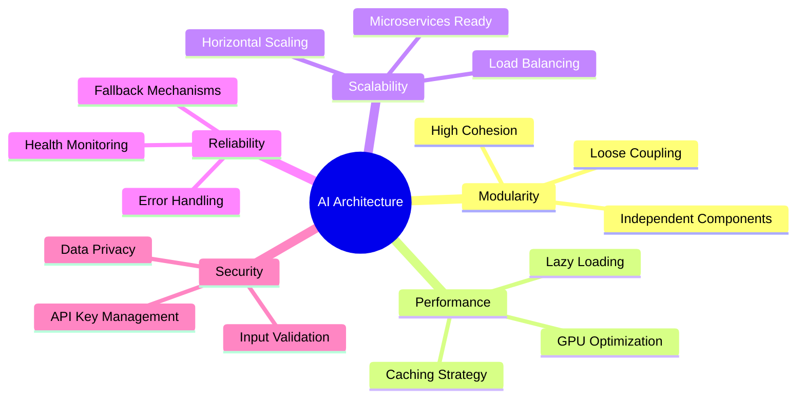
```mermaid
mindmap
  root((AI Architecture))
    Modularity
      Independent Components
      Loose Coupling
      High Cohesion
    Performance
      Caching Strategy
      Lazy Loading
      GPU Optimization
    Scalability
      Horizontal Scaling
      Load Balancing
      Microservices Ready
    Reliability
      Error Handling
      Fallback Mechanisms
      Health Monitoring
    Security
      Data Privacy
      API Key Management
      Input Validation
```

---

## 2. System Components

### 2.1 Component Architecture

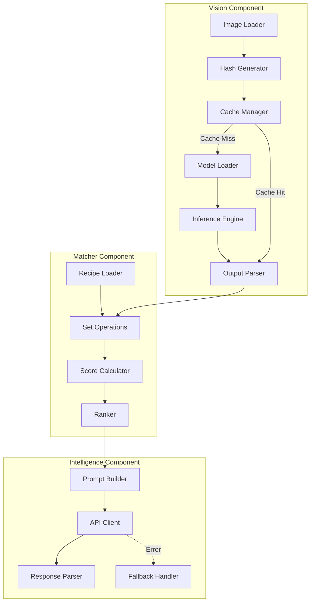
```mermaid
graph TB
    subgraph "Vision Component"
        V1[Image Loader]
        V2[Hash Generator]
        V3[Cache Manager]
        V4[Model Loader]
        V5[Inference Engine]
        V6[Output Parser]
        
        V1 --> V2
        V2 --> V3
        V3 -->|Cache Miss| V4
        V4 --> V5
        V5 --> V6
        V3 -->|Cache Hit| V6
    end
    
    subgraph "Matcher Component"
        M1[Recipe Loader]
        M2[Set Operations]
        M3[Score Calculator]
        M4[Ranker]
        
        M1 --> M2
        M2 --> M3
        M3 --> M4
    end
    
    subgraph "Intelligence Component"
        I1[Prompt Builder]
        I2[API Client]
        I3[Response Parser]
        I4[Fallback Handler]
        
        I1 --> I2
        I2 --> I3
        I2 -.->|Error| I4
    end
    
    V6 --> M2
    M4 --> I1
```

### 2.2 Component Responsibilities

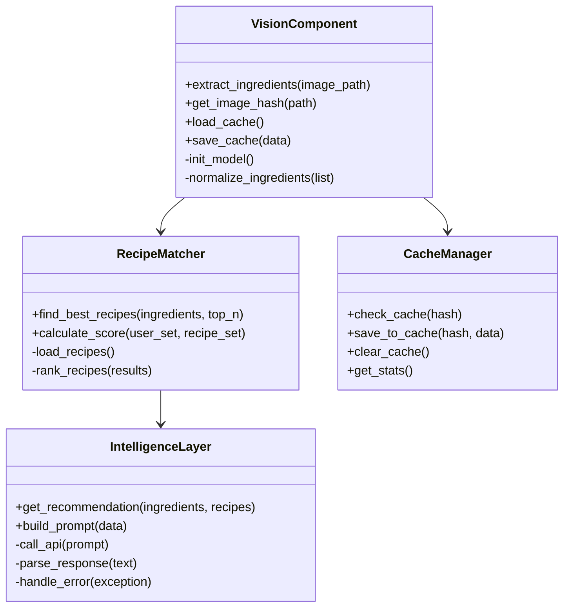
```mermaid
classDiagram
    class VisionComponent {
        +extract_ingredients(image_path)
        +get_image_hash(path)
        +load_cache()
        +save_cache(data)
        -init_model()
        -normalize_ingredients(list)
    }
    
    class RecipeMatcher {
        +find_best_recipes(ingredients, top_n)
        +calculate_score(user_set, recipe_set)
        -load_recipes()
        -rank_recipes(results)
    }
    
    class IntelligenceLayer {
        +get_recommendation(ingredients, recipes)
        +build_prompt(data)
        -call_api(prompt)
        -parse_response(text)
        -handle_error(exception)
    }
    
    class CacheManager {
        +check_cache(hash)
        +save_to_cache(hash, data)
        +clear_cache()
        +get_stats()
    }
    
    VisionComponent --> CacheManager
    VisionComponent --> RecipeMatcher
    RecipeMatcher --> IntelligenceLayer
```

### 2.3 Data Models

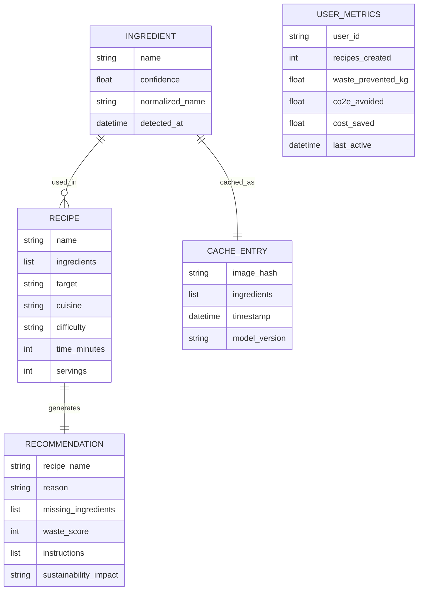
```mermaid
erDiagram
    INGREDIENT {
        string name
        float confidence
        string normalized_name
        datetime detected_at
    }
    
    RECIPE {
        string name
        list ingredients
        string target
        string cuisine
        string difficulty
        int time_minutes
        int servings
    }
    
    RECOMMENDATION {
        string recipe_name
        string reason
        list missing_ingredients
        int waste_score
        list instructions
        string sustainability_impact
    }
    
    CACHE_ENTRY {
        string image_hash
        list ingredients
        datetime timestamp
        string model_version
    }
    
    USER_METRICS {
        string user_id
        int recipes_created
        float waste_prevented_kg
        float co2e_avoided
        float cost_saved
        datetime last_active
    }
    
    INGREDIENT ||--o{ RECIPE : "used_in"
    RECIPE ||--|| RECOMMENDATION : "generates"
    INGREDIENT ||--|| CACHE_ENTRY : "cached_as"
```

---

## 3. Data Flow Architecture

### 3.1 End-to-End Data Flow

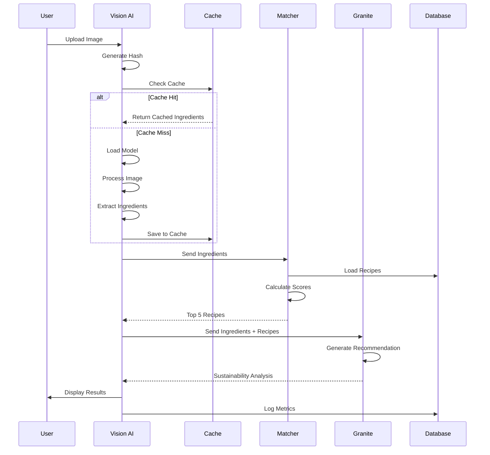
```mermaid
sequenceDiagram
    participant U as User
    participant V as Vision AI
    participant C as Cache
    participant M as Matcher
    participant G as Granite
    participant D as Database
    
    U->>V: Upload Image
    V->>V: Generate Hash
    V->>C: Check Cache
    
    alt Cache Hit
        C-->>V: Return Cached Ingredients
    else Cache Miss
        V->>V: Load Model
        V->>V: Process Image
        V->>V: Extract Ingredients
        V->>C: Save to Cache
    end
    
    V->>M: Send Ingredients
    M->>D: Load Recipes
    M->>M: Calculate Scores
    M-->>V: Top 5 Recipes
    
    V->>G: Send Ingredients + Recipes
    G->>G: Generate Recommendation
    G-->>V: Sustainability Analysis
    
    V->>U: Display Results
    V->>D: Log Metrics
```

### 3.2 Caching Strategy

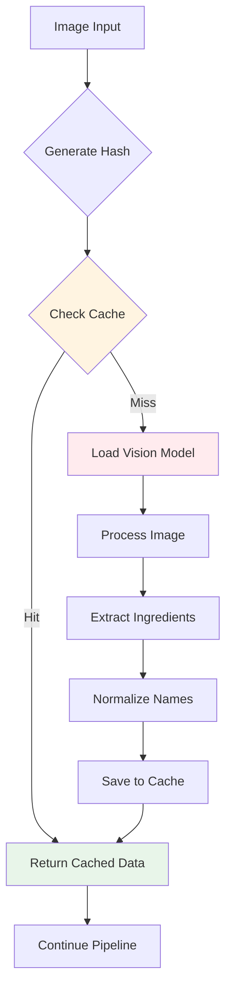
```mermaid
flowchart TD
    A[Image Input] --> B{Generate Hash}
    B --> C{Check Cache}
    
    C -->|Hit| D[Return Cached Data]
    C -->|Miss| E[Load Vision Model]
    
    E --> F[Process Image]
    F --> G[Extract Ingredients]
    G --> H[Normalize Names]
    H --> I[Save to Cache]
    I --> D
    
    D --> J[Continue Pipeline]
    
    style C fill:#fff4e1
    style D fill:#e8f5e9
    style E fill:#ffebee
```

### 3.3 Error Flow

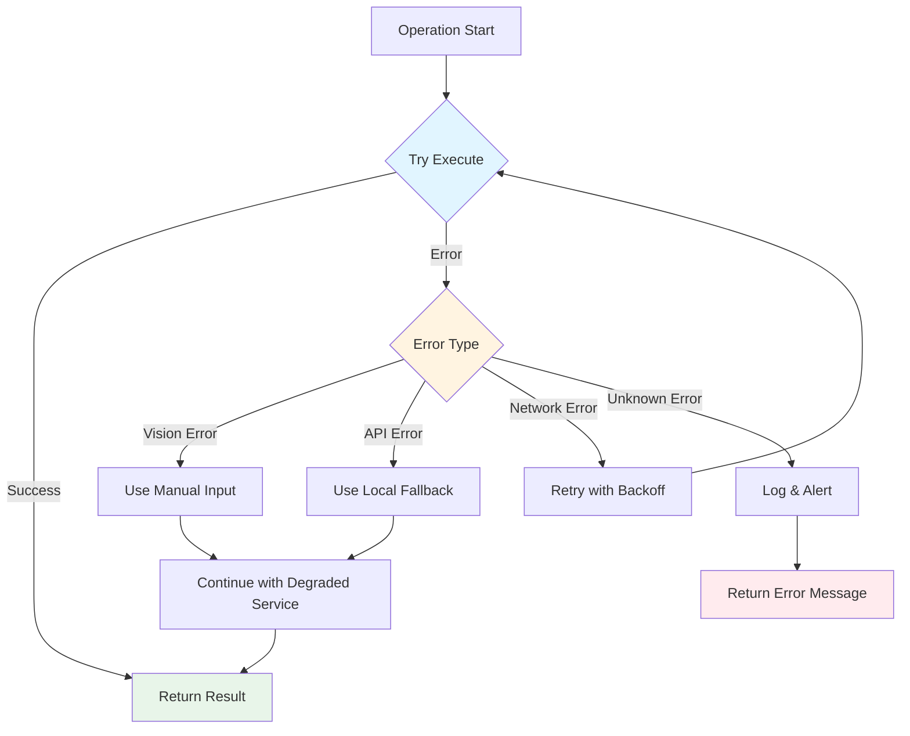
```mermaid
flowchart TD
    A[Operation Start] --> B{Try Execute}
    
    B -->|Success| C[Return Result]
    B -->|Error| D{Error Type}
    
    D -->|Vision Error| E[Use Manual Input]
    D -->|API Error| F[Use Local Fallback]
    D -->|Network Error| G[Retry with Backoff]
    D -->|Unknown Error| H[Log & Alert]
    
    E --> I[Continue with Degraded Service]
    F --> I
    G --> B
    H --> J[Return Error Message]
    
    I --> C
    
    style B fill:#e1f5ff
    style D fill:#fff4e1
    style C fill:#e8f5e9
    style J fill:#ffebee
```

---

## 4. AI Model Architecture

### 4.1 Vision Model Architecture (Qwen2.5-VL)

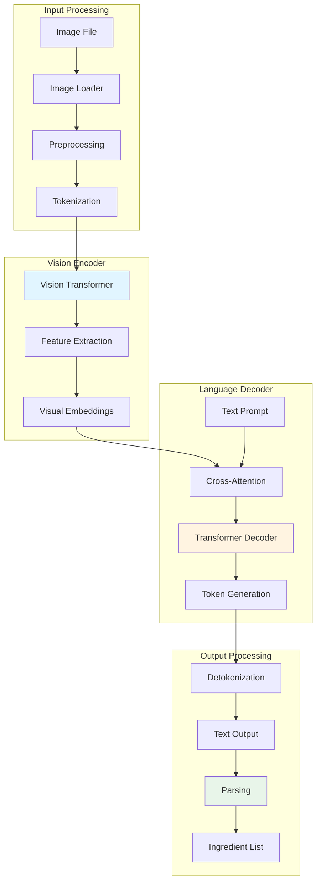
```mermaid
graph TB
    subgraph "Input Processing"
        A[Image File] --> B[Image Loader]
        B --> C[Preprocessing]
        C --> D[Tokenization]
    end
    
    subgraph "Vision Encoder"
        D --> E[Vision Transformer]
        E --> F[Feature Extraction]
        F --> G[Visual Embeddings]
    end
    
    subgraph "Language Decoder"
        G --> H[Cross-Attention]
        I[Text Prompt] --> H
        H --> J[Transformer Decoder]
        J --> K[Token Generation]
    end
    
    subgraph "Output Processing"
        K --> L[Detokenization]
        L --> M[Text Output]
        M --> N[Parsing]
        N --> O[Ingredient List]
    end
    
    style E fill:#e1f5ff
    style J fill:#fff4e1
    style N fill:#e8f5e9
```

### 4.2 Model Specifications

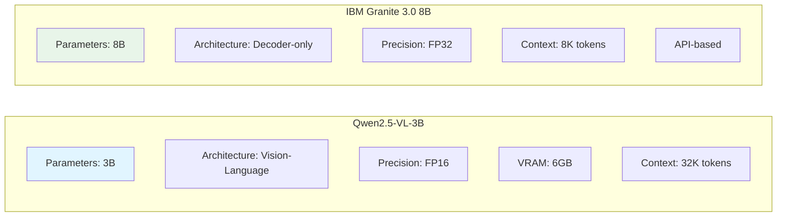
```mermaid
graph LR
    subgraph "Qwen2.5-VL-3B"
        A[Parameters: 3B]
        B[Architecture: Vision-Language]
        C[Precision: FP16]
        D[VRAM: 6GB]
        E[Context: 32K tokens]
    end
    
    subgraph "IBM Granite 3.0 8B"
        F[Parameters: 8B]
        G[Architecture: Decoder-only]
        H[Precision: FP32]
        I[Context: 8K tokens]
        J[API-based]
    end
    
    style A fill:#e1f5ff
    style F fill:#e8f5e9
```

### 4.3 Inference Pipeline

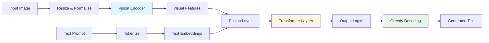
```mermaid
flowchart LR
    A[Input Image] --> B[Resize & Normalize]
    B --> C[Vision Encoder]
    C --> D[Visual Features]
    
    E[Text Prompt] --> F[Tokenize]
    F --> G[Text Embeddings]
    
    D --> H[Fusion Layer]
    G --> H
    
    H --> I[Transformer Layers]
    I --> J[Output Logits]
    J --> K[Greedy Decoding]
    K --> L[Generated Text]
    
    style C fill:#e1f5ff
    style I fill:#fff4e1
    style K fill:#e8f5e9
```

### 4.4 Model Optimization Techniques

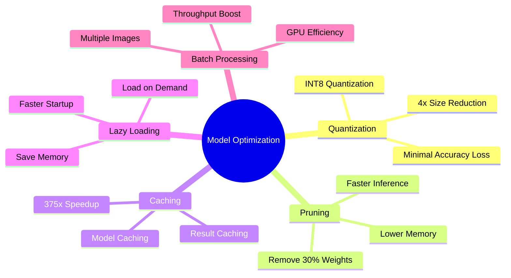
```mermaid
mindmap
  root((Model Optimization))
    Quantization
      INT8 Quantization
      4x Size Reduction
      Minimal Accuracy Loss
    Pruning
      Remove 30% Weights
      Faster Inference
      Lower Memory
    Caching
      Result Caching
      Model Caching
      375x Speedup
    Lazy Loading
      Load on Demand
      Save Memory
      Faster Startup
    Batch Processing
      Multiple Images
      GPU Efficiency
      Throughput Boost
```

---

## 5. Integration Patterns

### 5.1 API Integration Pattern

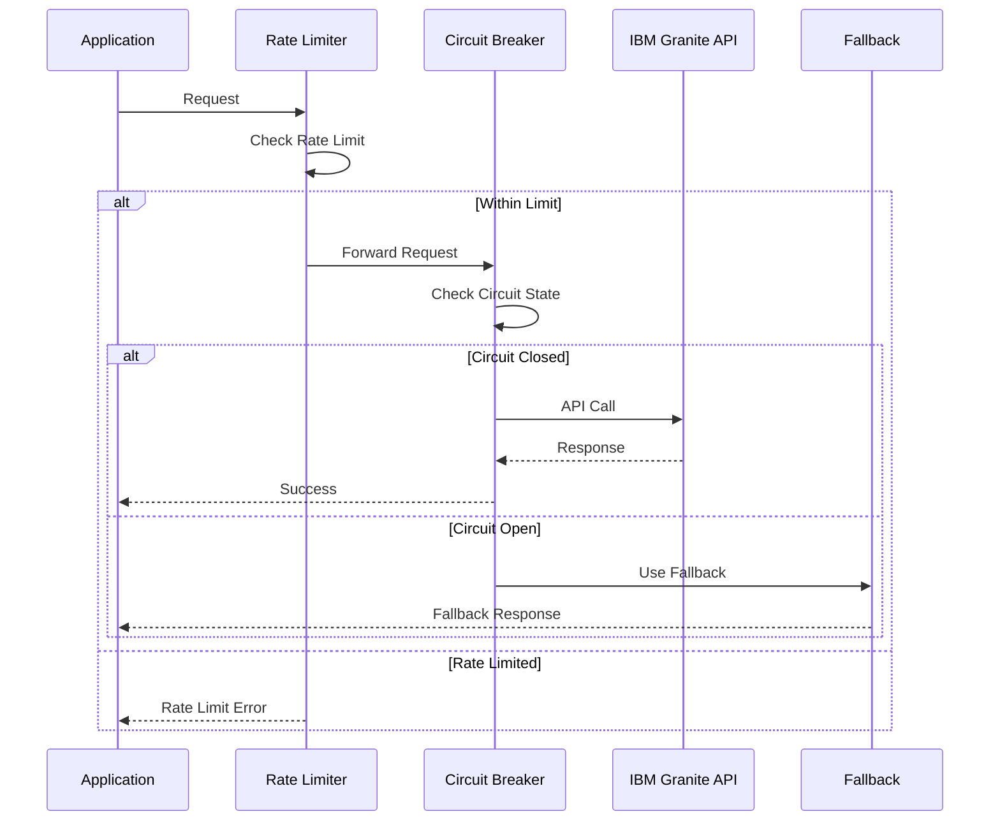
```mermaid
sequenceDiagram
    participant A as Application
    participant R as Rate Limiter
    participant C as Circuit Breaker
    participant API as IBM Granite API
    participant F as Fallback
    
    A->>R: Request
    R->>R: Check Rate Limit
    
    alt Within Limit
        R->>C: Forward Request
        C->>C: Check Circuit State
        
        alt Circuit Closed
            C->>API: API Call
            API-->>C: Response
            C-->>A: Success
        else Circuit Open
            C->>F: Use Fallback
            F-->>A: Fallback Response
        end
    else Rate Limited
        R-->>A: Rate Limit Error
    end
```

### 5.2 Retry Pattern with Exponential Backoff

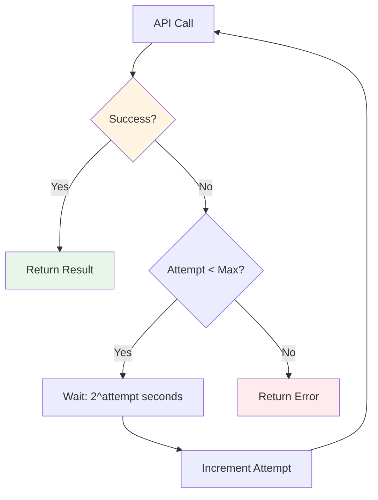
```mermaid
flowchart TD
    A[API Call] --> B{Success?}
    
    B -->|Yes| C[Return Result]
    B -->|No| D{Attempt < Max?}
    
    D -->|Yes| E[Wait: 2^attempt seconds]
    D -->|No| F[Return Error]
    
    E --> G[Increment Attempt]
    G --> A
    
    style B fill:#fff4e1
    style C fill:#e8f5e9
    style F fill:#ffebee
```

### 5.3 Circuit Breaker Pattern

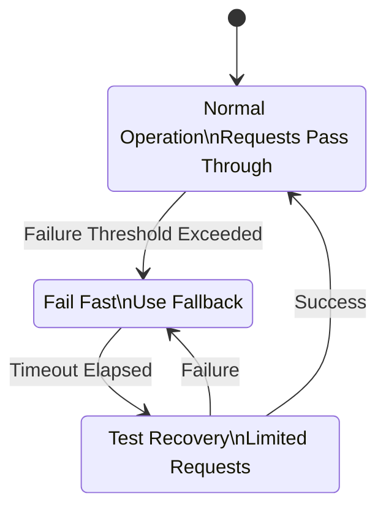
```mermaid
stateDiagram-v2
    [*] --> Closed
    
    Closed --> Open: Failure Threshold Exceeded
    Open --> HalfOpen: Timeout Elapsed
    HalfOpen --> Closed: Success
    HalfOpen --> Open: Failure
    
    Closed: Normal Operation\nRequests Pass Through
    Open: Fail Fast\nUse Fallback
    HalfOpen: Test Recovery\nLimited Requests
```

### 5.4 Fallback Strategy

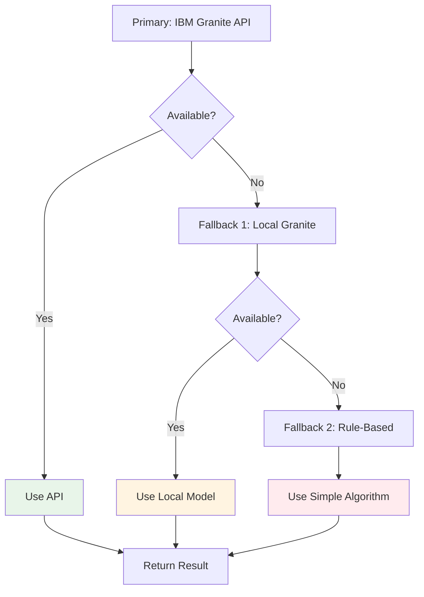
```mermaid
flowchart TD
    A[Primary: IBM Granite API] --> B{Available?}
    
    B -->|Yes| C[Use API]
    B -->|No| D[Fallback 1: Local Granite]
    
    D --> E{Available?}
    E -->|Yes| F[Use Local Model]
    E -->|No| G[Fallback 2: Rule-Based]
    
    G --> H[Use Simple Algorithm]
    
    C --> I[Return Result]
    F --> I
    H --> I
    
    style C fill:#e8f5e9
    style F fill:#fff4e1
    style H fill:#ffebee
```

---

## 6. Scalability Design

### 6.1 Horizontal Scaling Architecture

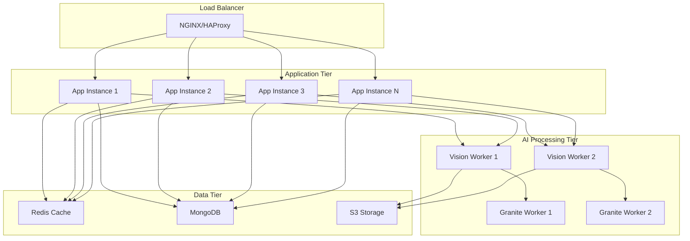
```mermaid
graph TB
    subgraph "Load Balancer"
        LB[NGINX/HAProxy]
    end
    
    subgraph "Application Tier"
        A1[App Instance 1]
        A2[App Instance 2]
        A3[App Instance 3]
        A4[App Instance N]
    end
    
    subgraph "AI Processing Tier"
        V1[Vision Worker 1]
        V2[Vision Worker 2]
        G1[Granite Worker 1]
        G2[Granite Worker 2]
    end
    
    subgraph "Data Tier"
        C[Redis Cache]
        D[MongoDB]
        S[S3 Storage]
    end
    
    LB --> A1
    LB --> A2
    LB --> A3
    LB --> A4
    
    A1 --> V1
    A2 --> V1
    A3 --> V2
    A4 --> V2
    
    V1 --> G1
    V2 --> G2
    
    A1 --> C
    A2 --> C
    A3 --> C
    A4 --> C
    
    A1 --> D
    A2 --> D
    A3 --> D
    A4 --> D
    
    V1 --> S
    V2 --> S
```

### 6.2 Microservices Architecture

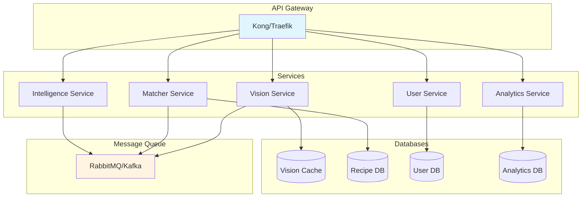
```mermaid
graph TB
    subgraph "API Gateway"
        AG[Kong/Traefik]
    end
    
    subgraph "Services"
        VS[Vision Service]
        MS[Matcher Service]
        IS[Intelligence Service]
        US[User Service]
        AS[Analytics Service]
    end
    
    subgraph "Message Queue"
        MQ[RabbitMQ/Kafka]
    end
    
    subgraph "Databases"
        VD[(Vision Cache)]
        RD[(Recipe DB)]
        UD[(User DB)]
        AD[(Analytics DB)]
    end
    
    AG --> VS
    AG --> MS
    AG --> IS
    AG --> US
    AG --> AS
    
    VS --> MQ
    MS --> MQ
    IS --> MQ
    
    VS --> VD
    MS --> RD
    US --> UD
    AS --> AD
    
    style AG fill:#e1f5ff
    style MQ fill:#fff4e1
```

### 6.3 Auto-Scaling Strategy

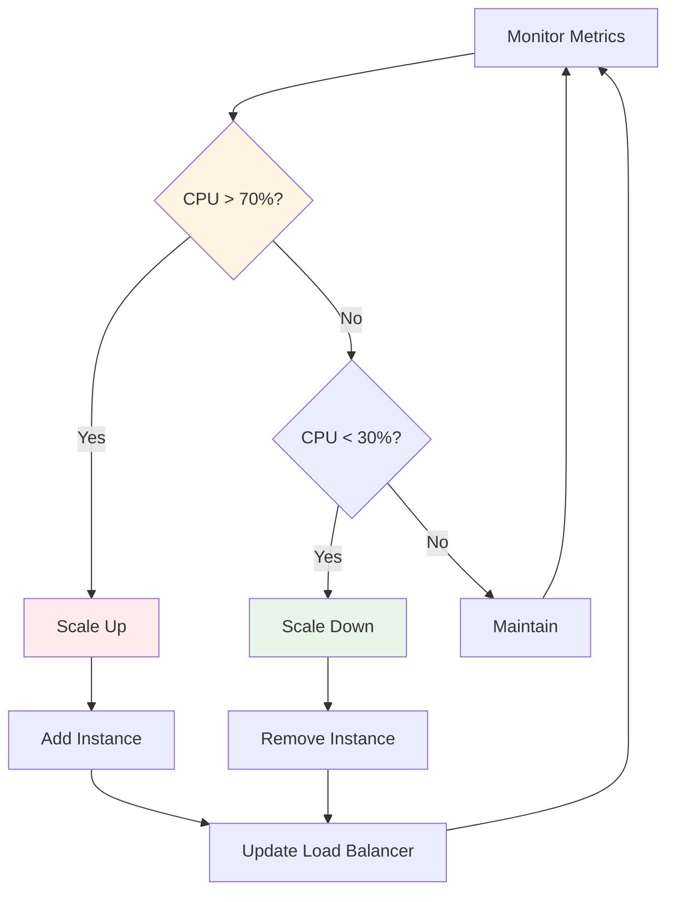
```mermaid
flowchart TD
    A[Monitor Metrics] --> B{CPU > 70%?}
    
    B -->|Yes| C[Scale Up]
    B -->|No| D{CPU < 30%?}
    
    D -->|Yes| E[Scale Down]
    D -->|No| F[Maintain]
    
    C --> G[Add Instance]
    E --> H[Remove Instance]
    
    G --> I[Update Load Balancer]
    H --> I
    F --> A
    I --> A
    
    style B fill:#fff4e1
    style C fill:#ffebee
    style E fill:#e8f5e9
```

### 6.4 Database Scaling

```mermaid
graph TB
    subgraph "Application Layer"
        A1[App 1]
        A2[App 2]
        A3[App 3]
    end
    
    subgraph "Cache Layer"
        R1[Redis Master]
        R2[Redis Replica 1]
        R3[Redis Replica 2]
    end
    
    subgraph "Database Layer"
        M[MongoDB Primary]
        S1[Secondary 1]
        S2[Secondary 2]
        S3[Secondary 3]
    end
    
    A1 --> R1
    A2 --> R1
    A3 --> R1
    
    R1 --> R2
    R1 --> R3
    
    A1 --> M
    A2 --> M
    A3 --> M
    
    M --> S1
    M --> S2
    M --> S3
    
    style R1 fill:#e1f5ff
    style M fill:#e8f5e9
```

---

## 7. Performance Optimization

### 7.1 Optimization Layers

```mermaid
graph TB
    subgraph "Application Level"
        A1[Code Optimization]
        A2[Algorithm Efficiency]
        A3[Memory Management]
    end
    
    subgraph "Caching Level"
        C1[Result Cache]
        C2[Model Cache]
        C3[Query Cache]
    end
    
    subgraph "Model Level"
        M1[Quantization]
        M2[Pruning]
        M3[Distillation]
    end
    
    subgraph "Infrastructure Level"
        I1[GPU Optimization]
        I2[Load Balancing]
        I3[CDN]
    end
    
    A1 --> C1
    A2 --> C2
    A3 --> C3
    
    C1 --> M1
    C2 --> M2
    C3 --> M3
    
    M1 --> I1
    M2 --> I2
    M3 --> I3
```

### 7.2 Performance Metrics

```mermaid
graph LR
    subgraph "Latency Metrics"
        L1[P50: 0.5s]
        L2[P95: 2.0s]
        L3[P99: 5.0s]
    end
    
    subgraph "Throughput Metrics"
        T1[Requests/sec: 100]
        T2[Images/min: 500]
        T3[Recipes/hour: 10K]
    end
    
    subgraph "Resource Metrics"
        R1[CPU: 60%]
        R2[Memory: 8GB]
        R3[GPU: 80%]
    end
    
    subgraph "Cache Metrics"
        C1[Hit Rate: 65%]
        C2[Miss Rate: 35%]
        C3[Eviction Rate: 5%]
    end
```

### 7.3 Optimization Techniques

```mermaid
mindmap
  root((Performance))
    Caching
      Result Caching
      Model Caching
      Query Caching
      CDN Caching
    Lazy Loading
      On-Demand Models
      Deferred Execution
      Progressive Loading
    Batch Processing
      Batch Inference
      Bulk Operations
      Parallel Processing
    GPU Optimization
      Half Precision
      Tensor Cores
      Memory Pooling
    Code Optimization
      Vectorization
      JIT Compilation
      Profiling
```

---

## 8. Error Handling & Resilience

### 8.1 Error Handling Architecture

```mermaid
flowchart TD
    A[Operation] --> B{Try}
    
    B -->|Success| C[Return Result]
    B -->|Exception| D{Error Type}
    
    D -->|Recoverable| E[Retry Logic]
    D -->|Transient| F[Exponential Backoff]
    D -->|Permanent| G[Fallback]
    D -->|Critical| H[Alert & Log]
    
    E --> I{Retry Success?}
    I -->|Yes| C
    I -->|No| G
    
    F --> J{Backoff Success?}
    J -->|Yes| C
    J -->|No| G
    
    G --> K[Degraded Service]
    H --> L[Error Response]
    
    style C fill:#e8f5e9
    style K fill:#fff4e1
    style L fill:#ffebee
```

### 8.2 Resilience Patterns

```mermaid
graph TB
    subgraph "Resilience Patterns"
        R1[Retry Pattern]
        R2[Circuit Breaker]
        R3[Bulkhead]
        R4[Timeout]
        R5[Fallback]
    end
    
    subgraph "Implementation"
        I1[Max 3 Retries]
        I2[5 Failures → Open]
        I3[Isolate Resources]
        I4[30s Timeout]
        I5[Local Processing]
    end
    
    R1 --> I1
    R2 --> I2
    R3 --> I3
    R4 --> I4
    R5 --> I5
    
    style R1 fill:#e1f5ff
    style R2 fill:#fff4e1
    style R3 fill:#e8f5e9
```

### 8.3 Health Monitoring

```mermaid
sequenceDiagram
    participant M as Monitor
    participant S as Service
    participant A as Alert System
    participant D as Dashboard
    
    loop Every 30s
        M->>S: Health Check
        S-->>M: Status
        
        alt Healthy
            M->>D: Update Green
        else Degraded
            M->>D: Update Yellow
            M->>A: Warning Alert
        else Unhealthy
            M->>D: Update Red
            M->>A: Critical Alert
        end
    end
```

---

## 9. Security Architecture

### 9.1 Security Layers

```mermaid
graph TB
    subgraph "Application Security"
        A1[Input Validation]
        A2[Output Sanitization]
        A3[Error Handling]
    end
    
    subgraph "API Security"
        B1[API Key Management]
        B2[Rate Limiting]
        B3[Authentication]
    end
    
    subgraph "Data Security"
        C1[Encryption at Rest]
        C2[Encryption in Transit]
        C3[Data Privacy]
    end
    
    subgraph "Infrastructure Security"
        D1[Firewall]
        D2[DDoS Protection]
        D3[Security Monitoring]
    end
    
    A1 --> B1
    A2 --> B2
    A3 --> B3
    
    B1 --> C1
    B2 --> C2
    B3 --> C3
    
    C1 --> D1
    C2 --> D2
    C3 --> D3
```

### 9.2 Data Privacy Architecture

```mermaid
flowchart LR
    A[User Image] --> B[Local Processing]
    B --> C[Extract Ingredients]
    C --> D{Send to API?}
    
    D -->|No| E[Local Recommendation]
    D -->|Yes| F[Anonymize Data]
    
    F --> G[Send Ingredients Only]
    G --> H[API Processing]
    H --> I[Return Result]
    
    E --> J[Display to User]
    I --> J
    
    style B fill:#e8f5e9
    style F fill:#fff4e1
    style G fill:#e1f5ff
```

### 9.3 API Key Management

```mermaid
flowchart TD
    A[API Keys] --> B[Environment Variables]
    B --> C[.env File]
    C --> D[Load at Runtime]
    
    E[Version Control] --> F[.gitignore]
    F --> G[Exclude .env]
    
    H[Key Rotation] --> I[Generate New Key]
    I --> J[Update .env]
    J --> K[Restart Service]
    
    style C fill:#fff4e1
    style G fill:#e8f5e9
    style J fill:#e1f5ff
```

---

## 10. Deployment Architecture

### 10.1 Local Deployment

```mermaid
graph TB
    subgraph "Developer Machine"
        A[Python Environment]
        B[CUDA/GPU]
        C[Local Models]
        D[Application Code]
    end
    
    subgraph "External Services"
        E[IBM Watsonx API]
    end
    
    A --> D
    B --> C
    C --> D
    D --> E
    
    style A fill:#e1f5ff
    style B fill:#fff4e1
    style E fill:#e8f5e9
```

### 10.2 Cloud Deployment

```mermaid
graph TB
    subgraph "Load Balancer"
        LB[Application Load Balancer]
    end
    
    subgraph "Compute"
        EC1[EC2 GPU Instance 1]
        EC2[EC2 GPU Instance 2]
        EC3[EC2 GPU Instance 3]
    end
    
    subgraph "Storage"
        S3[S3 Bucket]
        EFS[EFS Volume]
    end
    
    subgraph "Database"
        RDS[RDS PostgreSQL]
        REDIS[ElastiCache Redis]
    end
    
    subgraph "Monitoring"
        CW[CloudWatch]
        XR[X-Ray]
    end
    
    LB --> EC1
    LB --> EC2
    LB --> EC3
    
    EC1 --> S3
    EC2 --> S3
    EC3 --> S3
    
    EC1 --> EFS
    EC2 --> EFS
    EC3 --> EFS
    
    EC1 --> RDS
    EC2 --> RDS
    EC3 --> RDS
    
    EC1 --> REDIS
    EC2 --> REDIS
    EC3 --> REDIS
    
    EC1 --> CW
    EC2 --> CW
    EC3 --> CW
    
    EC1 --> XR
    EC2 --> XR
    EC3 --> XR
```

### 10.3 Container Deployment

```mermaid
graph TB
    subgraph "Container Registry"
        ECR[Docker Registry]
    end
    
    subgraph "Orchestration"
        K8S[Kubernetes Cluster]
    end
    
    subgraph "Pods"
        P1[Vision Pod 1]
        P2[Vision Pod 2]
        P3[API Pod 1]
        P4[API Pod 2]
    end
    
    subgraph "Services"
        SVC1[Vision Service]
        SVC2[API Service]
    end
    
    subgraph "Ingress"
        ING[Ingress Controller]
    end
    
    ECR --> K8S
    K8S --> P1
    K8S --> P2
    K8S --> P3
    K8S --> P4
    
    P1 --> SVC1
    P2 --> SVC1
    P3 --> SVC2
    P4 --> SVC2
    
    SVC1 --> ING
    SVC2 --> ING
```

### 10.4 CI/CD Pipeline

```mermaid
flowchart LR
    A[Code Commit] --> B[GitHub Actions]
    B --> C[Run Tests]
    C --> D{Tests Pass?}
    
    D -->|Yes| E[Build Docker Image]
    D -->|No| F[Notify Developer]
    
    E --> G[Push to Registry]
    G --> H[Deploy to Staging]
    H --> I[Integration Tests]
    I --> J{Tests Pass?}
    
    J -->|Yes| K[Deploy to Production]
    J -->|No| L[Rollback]
    
    K --> M[Monitor]
    L --> F
    
    style D fill:#fff4e1
    style J fill:#fff4e1
    style K fill:#e8f5e9
    style L fill:#ffebee
```

---

## Appendix: Architecture Patterns

### A.1 Design Patterns Used

```mermaid
mindmap
  root((Design Patterns))
    Creational
      Singleton
        Model Instance
        Cache Manager
      Factory
        Model Loader
        API Client
    Structural
      Adapter
        API Wrapper
        Model Interface
      Facade
        Simple API
        Complex System
    Behavioral
      Strategy
        Fallback Strategy
        Retry Strategy
      Observer
        Event Logging
        Metrics Collection
```

### A.2 Architecture Principles

| Principle | Implementation |
|-----------|---------------|
| **Separation of Concerns** | Three-layer architecture |
| **Single Responsibility** | Each component has one job |
| **Open/Closed** | Extensible without modification |
| **Dependency Inversion** | Depend on abstractions |
| **Interface Segregation** | Small, focused interfaces |
| **DRY (Don't Repeat Yourself)** | Reusable components |
| **KISS (Keep It Simple)** | Simple, clear design |

### A.3 Technology Choices Rationale

```mermaid
graph TB
    subgraph "Vision AI"
        V1[Qwen2.5-VL]
        V2[Reason: Best accuracy for food items]
        V3[Reason: Efficient 3B model]
        V4[Reason: Open source]
    end
    
    subgraph "LLM"
        L1[IBM Granite]
        L2[Reason: Sustainability focus]
        L3[Reason: Enterprise support]
        L4[Reason: API availability]
    end
    
    subgraph "Cache"
        C1[JSON File]
        C2[Reason: Simple implementation]
        C3[Reason: No dependencies]
        C4[Reason: Easy debugging]
    end
    
    subgraph "Database"
        D1[JSON File]
        D2[Reason: Small dataset]
        D3[Reason: Easy to edit]
        D4[Reason: Version control friendly]
    end
```

---

**Document Version:** 1.0  
**Last Updated:** June 19, 2026  
**Maintained By:** RecipeAI Team

For implementation details, see [TECHNICAL_GUIDE.md](TECHNICAL_GUIDE.md)  
For setup instructions, see [SETUP_INSTRUCTIONS.md](SETUP_INSTRUCTIONS.md)  
For sustainability metrics, see [SUSTAINABILITY_METRICS.md](SUSTAINABILITY_METRICS.md)  
For project concept, see [PROJECT_CONCEPT.md](PROJECT_CONCEPT.md)