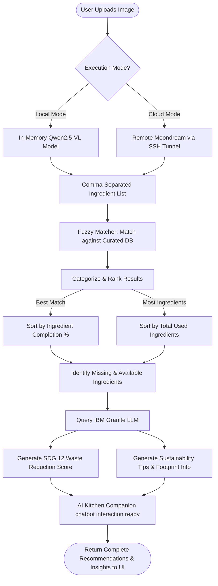
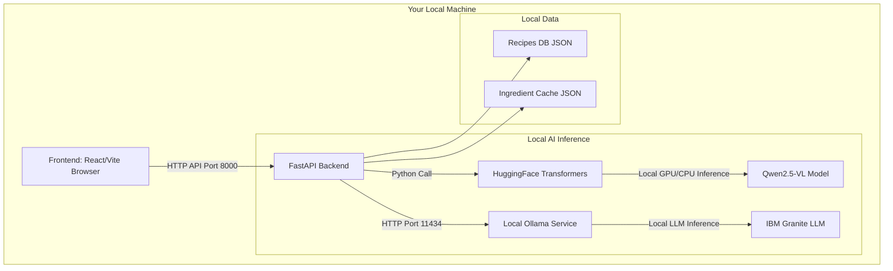
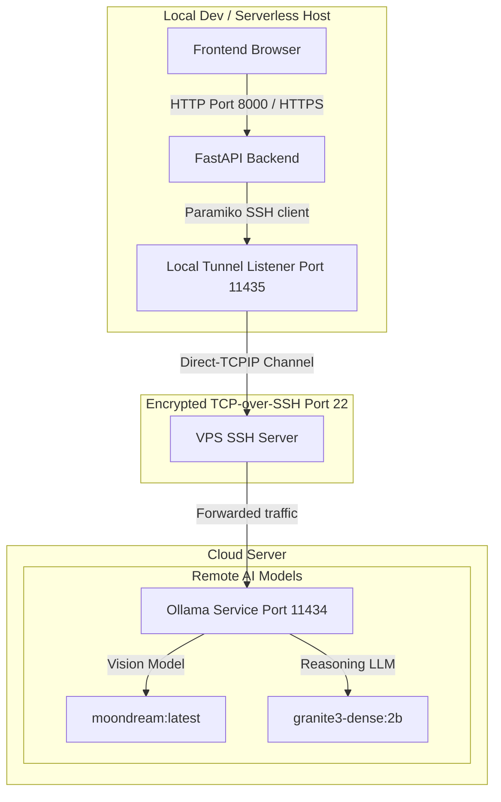

# Byte2Bite: Smart Refrigerator Inventory & Sustainable Recipe Assistant

Byte2Bite is an AI-powered web application designed to reduce household food waste (UN SDG 12: Responsible Consumption and Production) and mitigate household carbon emissions (UN SDG 13: Climate Action). 

By analyzing photos of refrigerator contents or kitchen pantries, Byte2Bite automatically detects ingredients, alerts users to highly perishable items, recommends creative recipes based on what is already available, and provides an interactive AI Chef companion for real-time culinary guidance.

---

## 🌟 Key Features

### 📸 Multimodal Refrigerator Scanner
* Upload a photo of your refrigerator or kitchen counter.
* The system utilizes the **Qwen-VL Vision model** (local) or **Moondream Vision model** (cloud) to recognize ingredients, draw labeled bounding boxes on the image, and compile a digital inventory list automatically.

### ⏱️ Spoilage Risk Alerts ("Use Soon")
* Perishable items (like milk, curd, paneer, and bread) are automatically flagged in the UI with a `Use Soon` warning badge, prompting cooks to prioritize utilizing soon-to-expire ingredients.

### 🥗 Smart Fuzzy Recipe Matcher
* Match available ingredients against a curated database of 138 recipes.
* Sort recipes by **Best Match** (maximum completion) or **Most Ingredients** (maximum ingredient utilization).
* View missing ingredients and instantly add them to a collapsible sidebar shopping list drawer.

### 🤖 IBM Granite Recommendation Engine
* Uses the **IBM Granite-3-Dense model** to analyze matched recipes.
* Generates an **SDG 12 Waste Reduction Score** (0-10) and explanation.
* Provides **Sustainability Tips**, including ingredient substitutions to reduce your carbon footprint.

### 💬 AI Kitchen Companion (Chatbot)
* Converse directly with "Chef Granite" about any recommended recipe.
* Request custom variations (e.g., "how can I cook this on a pan instead of an oven?"), ask for shelf-life storage tips, or find allergen substitutes.

---

## 🏗️ System Architecture & Data Flow

Byte2Bite utilizes a modular AI pipeline that coordinates computer vision, search, and LLM reasoning.

### 🔄 Data Processing Pipeline

Below is the step-by-step pipeline showing how raw image uploads are converted into recipe recommendations and sustainability scores:



---

## ⚙️ Execution Modes: Local vs. Cloud

Byte2Bite features a hybrid execution design that allows developers and users to toggle between **Local Mode** and **Cloud Mode** via configuration.

### 1. Local Mode Architecture

In **Local Mode**, the application runs entirely on your local workstation without external API requirements (except for initial model downloads).



* **Vision Model**: Qwen2.5-VL (`Qwen/Qwen2.5-VL-3B-Instruct`) loaded into Python memory using HuggingFace `transformers`.
* **Reasoning Model**: IBM Granite (`granite4:latest` or similar) running on a local Ollama instance (`http://localhost:11434`).

---

### 2. Cloud Mode Architecture (Secure SSH Tunnel)

In **Cloud Mode**, the application offloads heavy AI processing to a remote GPU/CPU server (VPS) over a secure, encrypted SSH port-forwarding tunnel. This bypasses client-side hardware requirements and restricted network environments (such as corporate or university firewalls).



* **SSH Port Forwarding**: At startup, the FastAPI backend initiates a background SSH connection to the remote VPS using Paramiko. It listens locally on port `11435`.
* **Traffic Flow**: Any request sent by the backend to `http://localhost:11435` is automatically intercepted, encrypted, and tunneled over port 22 to the VPS's localhost port `11434`.
* **Vision Model**: Remote Ollama processes the image using the lightweight `moondream:latest` model, which takes ~3 seconds to run on standard VPS CPUs.
* **Reasoning Model**: Remote Ollama runs IBM Granite (`granite3-dense:2b`) for lightweight, low-latency reasoning.

---

### 💡 Operational Guidelines: When to use what?

| Criterion | Local Mode | Cloud Mode |
| :--- | :--- | :--- |
| **Local Hardware** | **Requires Dedicated GPU** (NVIDIA CUDA or Apple Silicon Mac) with at least 8GB+ VRAM. | **Low-Spec Friendly**. Can run on simple laptops, tablets, or serverless hosts (Vercel/Cloudflare Pages). |
| **Internet Access** | **Fully Offline** (after initial model download). Ideal for offline dev or air-gapped systems. | **Requires Internet** to maintain connection and tunnel traffic to the remote VPS. |
| **Privacy / Security** | **Max Privacy**. Images and prompt data never leave your physical machine. | **Secured Transit**. Data is encrypted inside the SSH tunnel and processed on your own private VPS. |
| **Vision Inference Speed** | Fast (~2-5 seconds) when run on a compatible GPU. Slow on CPU. | Ultra-fast (~3 seconds) even on basic VPS CPUs due to the optimized `moondream:latest` model. |
| **Firewall Bypassing** | N/A (runs entirely locally). | **Excellent**. Uses port 22 (SSH) to tunnel HTTP traffic, bypassing outbound firewalls like Sophos that block unknown HTTP ports. |

---

## 🚀 Local Development Setup

### Prerequisites
* Python 3.10+
* Node.js (with npm)
* Git

### Step 1: Clone the repository
```bash
git clone https://github.com/programmingxpert/byte2bite.git
cd byte2bite
```

### Step 2: Configure Environment Variables
Create a `.env` file inside the `backend/` directory:
```env
MODEL_MODE=cloud # 'local' or 'cloud'

# Cloud SSH Tunnel settings (Required if MODEL_MODE=cloud)
CLOUD_SSH_HOST=64.227.167.140
CLOUD_SSH_USER=root
CLOUD_SSH_KEY_PATH= # Local path to private key (or leave empty if using CLOUD_SSH_KEY env string)
CLOUD_SSH_KEY= # Paste raw private key PEM string directly (useful for cloud hosting platforms)
CLOUD_SSH_PASSPHRASE=satya@123
CLOUD_OLLAMA_PORT=11434
```

### Step 3: Run the Application
You can run both frontend and backend development servers concurrently with a single command:
* On Windows, simply double-click the `run_dev.bat` script in the root directory.
* Alternatively, run them in separate terminals:
  * **Backend**:
    ```bash
    cd backend
    pip install -r requirements.txt
    python main.py
    ```
  * **Frontend**:
    ```bash
    cd frontend
    npm install
    npm run dev
    ```

---

## 🌐 Production Deployment (Cloudflare & Serverless)

### Frontend (Cloudflare Pages)
The static React app can be built and deployed directly to Cloudflare Pages:
```bash
cd frontend
npm run build
npx wrangler pages deploy dist --project-name byte2bite
```

### Backend (Vercel / VM Hosting)
The FastAPI backend is fully compatible with serverless platforms like Vercel (using the root `vercel.json` config) or can be run on a dedicated VM behind a reverse proxy or Cloudflare Tunnel. File uploads and cache files are routed to `/tmp` to support read-only container filesystems.

---

## 🤝 Authors & Credits
* **Primary Developer**: Satyasundar Behera (Alliance University)
* **Lead Researcher**: Aishani Dutta (Alliance University)
* *Developed in collaboration with IBM SkillsBuild & AICTE for the 1M1B AI for Sustainability Virtual Internship.*

---
// Made with Bob